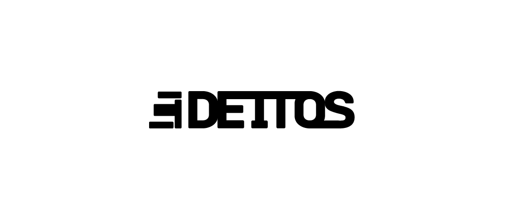

## 🚧🚧 Under Construction 🚧🚧

# deitos-node

This repository contains the implementation of the Deitos Network node. 

## What is Deitos Network?
At its core, the Deitos Network is an open and decentralized platform designed to democratize big data and AI model training. It serves as a transparent and collaborative ecosystem for data storage, processing, modeling, and training.

Within this ecosystem, two primary actors play a crucial role:

### Infrastructure Providers 
These contributors form the backbone of our network, offering computational resources, storage solutions, and processing power. In return for their contributions, they receive compensation from consumers.

### Consumers:
These individuals and organizations leverage our secure and decentralized environment to process data efficiently and train AI models. They gain access to well-processed and structured data, suitable for business analytics, predictive algorithms, and clean datasets for diverse machine learning applications, sourced from our network’s infrastructure providers.

Deitos's mission is to provide a comprehensive solution that caters to the needs of data scientists, researchers, and businesses, fostering collaboration and innovation in the world of big data and artificial intelligence (AI).

## The Importance of Agreements
Agreements in the Deitos Network are at the core of how Infrastructure Providers and Consumers interact collaboratively. Our approach is characterized by an innovative architectural design and a game theory strategy, where infrastructure providers actively compete to deliver the best services that cater to consumers’ specific needs.

At a high level, the interaction between network parties follows a structured flow. When a consumer identifies an infrastructure provider that aligns with their specific requirements, they initiate an agreement. This agreement encompasses:

Storage Volume: The amount of data to be uploaded and analyzed.
Computational Resources (TBD): Details about the computational resources needed, including virtual CPU cores (vCores) and RAM.
Duration: The timeframe for using storage and computational resources.
Payment Plan: The payment schedule, which can be arranged monthly, weekly, or as agreed upon by both parties.
In future developments, these providers may also engage in maintaining and utilizing a shared public dataset, receiving rewards for hosting this data and processing consumer requests.

## On-chain reputation system
After the conclusion of each agreement, participants can review their counterpart. This feedback contributes to an on-chain reputation system, fostering more secure interactions as the network evolves. However, in the event of disputes, neither party can leave feedback. Instead, the dispute’s outcome is recorded in their respective profiles.

## Dispute Resolvers Committee (TBD)
This group is tasked with resolving any disputes between consumers and infrastructure providers. Membership in this committee isn’t static. Individuals must first nominate themselves, after which all token holders can vote within a specified timeframe to determine the nominee’s inclusion. This election process is cyclical.

## Installatation and Local Development configuration

### Rust installation.

For instructions about how to set the corresponding rust environment, please refeer to this [rust-setup guide](docs/rust-setup.md).


### Build

Use the following command to build the node without launching it:

```sh
cargo build --release
```

### Embedded Docs

After you build the project, you can use the following command to explore its parameters and subcommands:

```sh
./target/release/deitos-node -h
```

You can generate and view the [Rust Docs](https://doc.rust-lang.org/cargo/commands/cargo-doc.html) for this template with this command:

```sh
cargo +nightly doc --open
```

### Single-Node Development Chain

The following command starts a single-node development chain that doesn't persist state:

```sh
./target/release/deitos-node --dev
```

To purge the development chain's state, run the following command:

```sh
./target/release/deitos-node purge-chain --dev
```

To start the development chain with detailed logging, run the following command:

```sh
RUST_BACKTRACE=1 ./target/release/deitos-node -ldebug --dev
```


## `pallet-deitos`

The Deitos node includes the `pallet-deitos` which contains the core foundational of the Deitos Network. For more information about the pallet functionalities please refeer to the [pallet's README](/pallets/deitos/README.md).