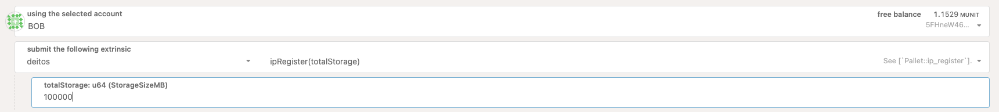
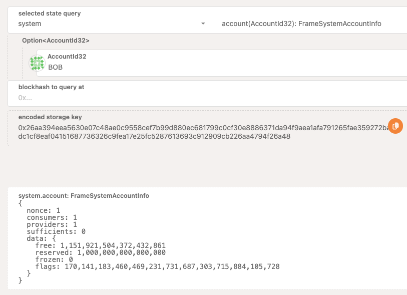
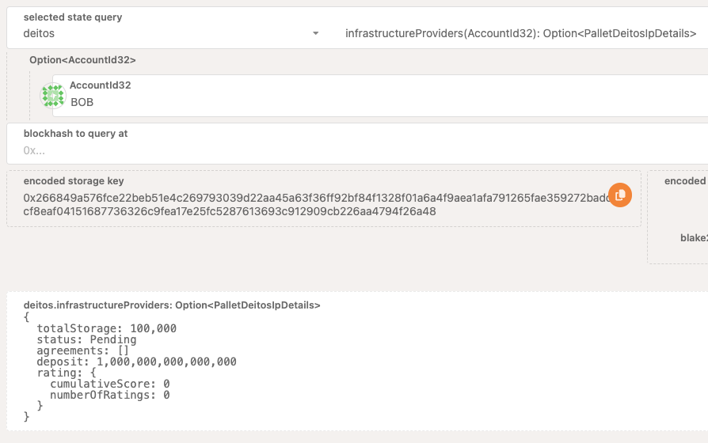
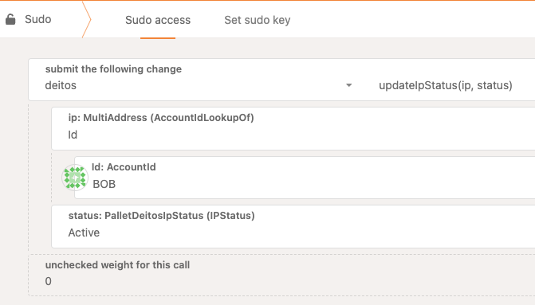

# `pallet-deitos` User Guide

This documentation contains a comprehensive guide to perform all the available interactions within the [`pallet-deitos`](pallets/deitos).

This user guide will be developed in a tutorial format, allowing to the user to interact with the following proceses:

- Infrastructure Provider registration.
- Submit an agreement request as a consumer. 
- Answer to the consumer's request as an Infrastructure Provider by accepting the initial request or by proposing a new payment plan.
- Operate and manage agreement's installments as a consumer.
- Close an agreement and submit the on chain reputation for the infrastrucure provider.

## Infrasctructure Provider Registration

For this test we will use BOB as the corresponding account to register the Infrastructure Provider.

In order to commit the registation, the infrastructure provider the following sequence should be executed:

1) Execute the `ipRegister` extrinsic:

This extrinsic will make the submission to register BOB as an IP indicating the infrastructure provider will provide 100 GB storage, expressed in MB (10000). The `IPRegistered` event will reflect this action:

In order to submit the intent of become an IP in the Deitos Network, the account should contain at least the minumum balance of 10.000 DEITOs. So, as soon as the `ipRegister` extrinsic is submitted, this amount is reserved from BOBs account. This can be checked by quering the account balance:

2) Manually activate the IP as root.

If we inspect the value of the `InfrastructureProviders` storage item for BOB, we can check that the IP status is `Pending`:

This status means that all the tech stack for the IP is currently being checked by the Deitos Protocol. During the validation, the Deitos protocol will trigger a set of tests that will validate that all the required services for the IP are up and running
As this validation is not developed yet, in order to activate the IP we will rely on the permissioned call `updateIPStatus` to continue with the test:

This will require using the Sudo tab, that because of the local settings the Root key was configured with ALICE account.

Up to this point we should have a fully functional and ready IP to accept agreements!

