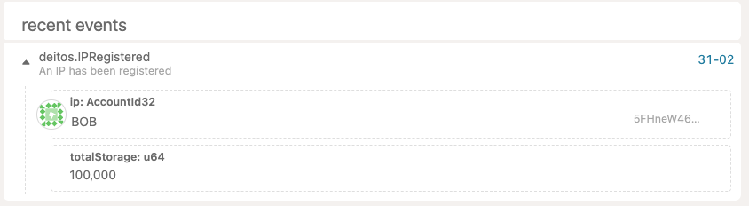
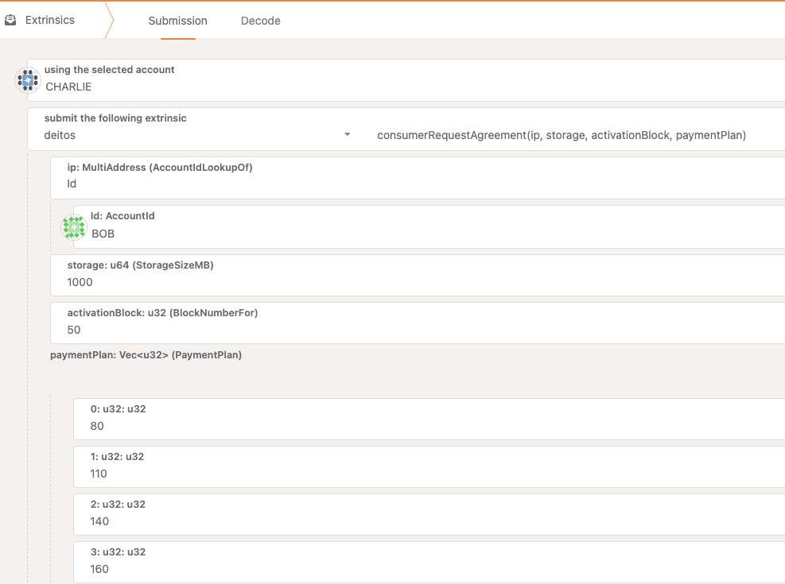
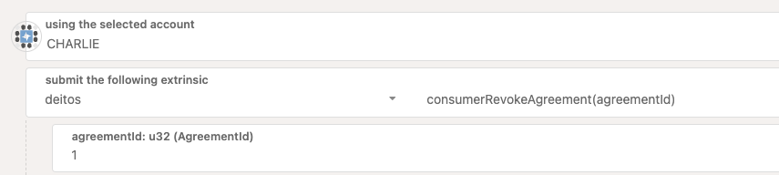

# `pallet-deitos` User Guide

This documentation contains a comprehensive guide to perform all the available interactions within the [`pallet-deitos`](pallets/deitos).

This user guide will be developed in a tutorial format, allowing to the user to interact with the following proceses:

- Infrastructure Provider registration.
- Submit an agreement request as a consumer. 
- Answer to the consumer's request as an Infrastructure Provider by accepting the initial request or by proposing a new payment plan.
- Operate and manage agreement's installments as a consumer.
- Close an agreement and submit the on chain reputation for the infrastrucure provider.

## 1 - Infrasctructure Provider Registration

For this test we will use BOB as the corresponding account to register the Infrastructure Provider.

In order to commit the registation, the infrastructure provider the following sequence should be executed:

### 1.1- Register Register

In order to start the registration for the IP the `ipRegister` extrinsic should be executed:

This extrinsic will make the submission to register BOB as an IP indicating the infrastructure provider will provide 100 GB storage, expressed in MB (10000). The `IPRegistered` event will reflect this action:

In order to submit the intent of become an IP in the Deitos Network, the account should contain at least the minumum balance of 10.000 DEITOs. So, as soon as the `ipRegister` extrinsic is submitted, this amount is reserved from BOBs account. This can be checked by quering the account balance:

### 1.2- Manually activate the IP as root.

If we inspect the value of the `InfrastructureProviders` storage item for BOB, we can check that the IP status is `Pending`:

This status means that all the tech stack for the IP is currently being checked by the Deitos Protocol. During the validation, the Deitos protocol will trigger a set of tests that will validate that all the required services for the IP are up and running
As this validation is not developed yet, in order to activate the IP we will rely on the permissioned call `updateIPStatus` to continue with the test:

This will require using the Sudo tab, that because of the local settings the Root key was configured with ALICE account.

Up to this point we should have a fully functional and ready IP to accept agreements!

## 2 - Agreement's submission (happy path)

Now we have an infrastructure provider up and running, the next step will be to submit an agreement request taking the consumer role. We will use the CHARLIE test account to play the role of a consumer.

### 2.1- Execute agreement's request (Consumer)

The first step to start the agreement negotiation process is that a consumer submits an agreement request to the selected IP. 

Let's review each parameter in detail:

Ip: Account for the selected infrastructure Provider.
Storage: The amount of storage to be used during the agreement. 
Activation block: As agreements can be negotiated, the activation block has to be set in the future. 
Payment Plan: This defines the duration of each period during the agreement indicating the beggining and end of each period. 

In the image attached, that would define the following periods for that agreement:

| Period | Start | End  | Duration | Installment |
|--------|-------|------|----------|-------------|
| 1      | 50    | 80   | 30       | 30,000,000 (3 DEITOs)  
| 2      | 80    | 110  | 30       | 30,000,000 (3 DEITOs) 
| 3      | 110   | 140  | 30       | 30,000,000 (3 DEITOs)  
| 4      | 140   | 160  | 20       | 20,000,000 (2 DEITOs) 

Once this is executed the following event would confirm the request:

In order to assure that consumer will honor the agreement with the IP the last installment (in this case installment #4) is already reserved from consumer's account as a "service deposit". Also there is a smaller deposit called "security deposit" which will be returned once the consumer submits the feedback after an agreement termination. This last deposit is a fixed amount of 1,000,000 units (0.1 DEITO)

If the account is inspected, we will see the reserved balance accordingly:

### 2.2- IP agreement request acceptance.

Once the request was submitted by the consumer, naturally the IP have to accept or deny the request. Also the IP is capable to propose a new payment plan that adjust better to its need, but we will leave that case for later.

For the moment the extrinsic `IpAcceptAgreement`  to accept the agreement is quite simple:

Once this is executed we will be able to see the status changes on the two events listed:

### 2.3- Consumer installment prepayment 

As the agreement is ready to start in the block 50, the consumer should commit the first installment prepay so the first period is financially covered:

This prepayment reserves the balance on the consumer account, which means that the funds are not available for the IP yet. This installment will be available to withdraw after the period is finished, following the example after the block 80.

If we inspect CHARLIE account we will see that the reserved balance now adds the first installment amount:

### 2.4- Inspecting agreement storage item

And if we inspect the agreement storage item, we will see all the detailed information for all the actions performed in regards this agreement:

Also we could see in the paymentHistory that the first prepay was already made and it will be available for the IP after the period ends.

### 2.5- Completing all the installment prepayments

In order to make this test simpler, we will just complete all the prepayments so the consumer does not get due with the payments. For doing this we just execute the same step as 2.3 the necessary times until all the installments are completed.

If we check the CHARLIE balance after this we will see the new reserved balance updated:

### 2.6- IP withdraw and agreement completion.

As the agreement came to an end, the IP is able now to withdraw all the corresponding installments for the service. The IP can withdraw all at once by just executing the following extrinsic

As a result, the following events will inform the withdraw and as the agreement was completed and nothing else should be paid, the system automatically change the status of the event to `Completed`:

### 2.7- IP Feedback submission for on-chain reputation

As the agreement has completed and nothing else is required, the last step to complete the whole flow would be to have the feedback submission of the IP in regards with the agreement:

The event reflects the feedback:

It worths mentioning that the consumer can submit a comment in the feedback which will be displayed in the events, but this text is not stored in any storage item.

As a result of the submission, the service deposit is unreserved:

### 2.8- Agreement cleanup

As we expect to have quite a big load of agreements, for storage optimization we decided to delete any storage item associated to finshed agreements. For querying historical agreements, archive nodes can be used along with some off chain indexing services similar to the ones used for block explorers

## 3 Agreement Renegotiation.

The deitos pallet concieves from its foundation the flexibility to let the IP and consumers to reach the best agreement for both parts. This means that if a consumer request and agreement where the payment plan does not suit the needs, the IP can propose a new payment plan which has to be accepted by the consumer.

### 3.1- Execute agreement's request (Consumer)

We will execute the following agreement which intends to set a very small security deposit since the last installment is very small compared to the rest of the agreement:

### 3.2- New payment plan proposal

Let's suppose the IP prefers to have a more unified payment plan with shorter periods. The IP can also propose a new payment plan:

The following event confirms the submission of the new payment plan:

### 3.3- Consumer rejects the new payment plan

In the case that the consumer does not want to accept the new payment plan proposed by the IP, the consumer can just revoke the agreeement:

The event confirms the agreement has been revoked and it also shows that the deposit amount for the agreement was unreserved and gave back to the consumer:

 ## 4 Agreements gets cancelled beacuse of unpaid installment

In this flow we are going to test how an agreement is terminated because the consumer stops paying. The consequence of this would make the agreement to be terminated, punishing the agreement with their deposits.

 ### 4.1- Execute agreement's request (Consumer)

 As usual we will make the consumer to request an agreement which will be accepted by the IP:

 ### 4.2- Acept agreement and make first installment.
 After the agreement was accepted by the IP and the agreement gets active, we will do the first installment pay so the agreement can commence as expected, resulting in the following agreement.

Once the first installment is paid, the following balance is reserved from the consumer account:

The total reserved amount is composed by : Service Deposit + First installment + Security Deposit (Last installment)

 ### 4.3- Terminate the agreement because of non payment.

 We should leave the blocks to go on and in this case we will not complete the payment from the consumer making the consumer to be at fault. So in this case once the IP detects that the payment was not done on time, the IP can terminate the agreement and punish the consumer:

This will result in the consumer being punished by having all its reserved funds for this agreement to be transferred to the IP and having the agreement finished.

As the agreement was finsihed and no more actions are required anymore, the related agreement storage items are cleaned up.

